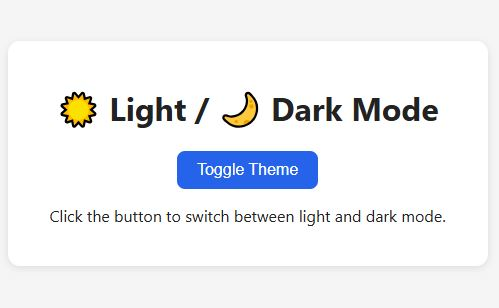

# 🌗 Light/Dark Mode Toggle (Mini Project)

A simple beginner-friendly project that lets the user switch between **light** and **dark** themes on a webpage with a single button click.  
It also remembers the user's theme preference using `localStorage`.

---

## 📁 Project Overview

This mini project is part of my **JavaScript Refresher** practice series.  
It focuses on **DOM manipulation**, **event handling**, and **class toggling** to apply different themes dynamically.

---

## 🚀 Features

- ✅ Toggle between light and dark themes  
- ✅ Smooth transition between colors  
- ✅ Saves the user’s preference to `localStorage`  
- ✅ Automatically restores the theme on page load  

---

## 🧠 What I Learned

- How to select DOM elements with `getElementById()`  
- Using `classList.toggle()` to apply or remove CSS classes  
- Handling click events with `addEventListener()`  
- Storing and retrieving data from `localStorage`  
- Creating smooth color transitions with CSS  

---
## 💡 How to Run

1. Clone or download this folder.  
2. Open `index.html` in your browser.  
3. Click the **Toggle Theme** button to switch between modes.  
4. Refresh the page — your selected theme will be remembered!

---
## 🔁 Possible Enhancements

- Add a toggle **switch icon** instead of a button  
- Add a third “system” mode to match OS theme  
- Use CSS variables for easier color management  

---

✨ **Practice Focus:**  
This project reinforces **DOM selection**, **events**, **CSS transitions**, and **persistent state management** — perfect for building good habits with small, clean commits.
