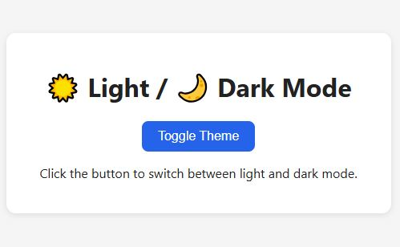

# 🎨 Hex Color Generator (Mini Project)

A simple JavaScript project that generates random **hex color codes** and displays them visually on the screen.  
Users can generate new colors and copy the hex code for use in their own designs or projects.

---

## 📁 Project Overview

This mini project is part of my **JavaScript Refresher** practice series.  
It focuses on **DOM manipulation**, **event handling**, **loops**, and **random value generation**.

---

## 🚀 Features

- ✅ Generate random hex color codes  
- ✅ Live color preview  
- ✅ Displays the hex color value  
- ✅ Click to copy color code to clipboard  
- ✅ Dynamic background color updates  
- ✅ Smooth UI transitions  

---

## 🧠 What I Learned

- How to select DOM elements using `getElementById()`  
- Handling user interactions with `addEventListener()`  
- Using `for` loops to build dynamic values  
- Generating random values with `Math.random()`  
- Updating styles dynamically using JavaScript  
- Working with strings to construct hex color codes  
- Using the Clipboard API (`navigator.clipboard`)  

---

## 💡 How to Run

1. Clone or download this folder  
2. Open `index.html` in your browser  
3. Click **Generate Color** to create a new color  
4. Click the color code to copy it  

---

## 🔁 Possible Enhancements

- Generate a full **color palette (multiple colors at once)**  
- Add a **history of previously generated colors**  
- Allow users to **save favorite colors**  
- Add **gradient color generation**  
- Improve accessibility (keyboard + screen reader support)  

---

✨ **Practice Focus:**  
This project reinforces **JavaScript fundamentals** such as loops, functions, and event handling, while building a real interactive UI component that mimics real-world frontend behavior.
